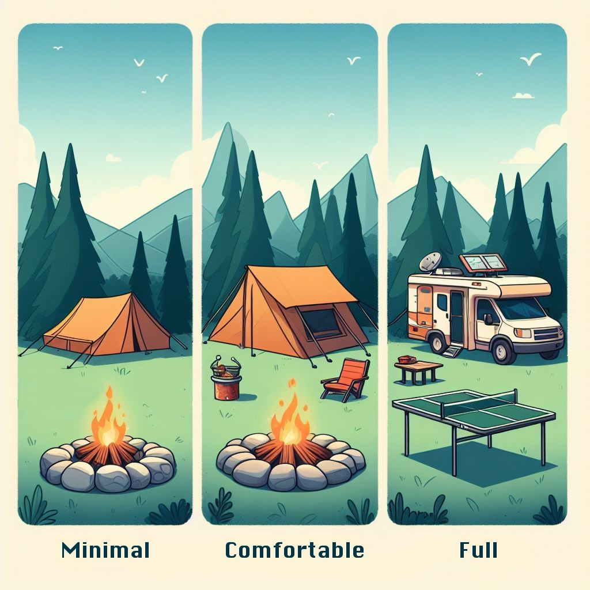

# Campsite

A single script to set up new or temporary machines with tools I use.

Comes in three flavors (ideally in two OSes, but just macOS for now):

- minimal: the cli essentials
- comfortable: includes commonly used programs used
- full: used for brand new computer setups; includes everything



Setup with the following command:

```zsh
/bin/zsh -c "$(curl -fsSL https://raw.githubusercontent.com/zackheil/campsite/main/assets/init.sh)"
```
